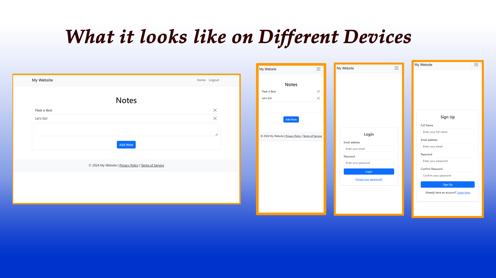

# Online Notebook

A **web application** that allows users to create, manage, and organize notes efficiently. Built using **Flask**, this project demonstrates fundamental full-stack web development skills.

## Features

- **User Authentication**:  
  Secure login and registration system to protect user data.
  
- **Create Notes**:  
  Users can create, edit, and delete personal notes.

- **Organized Interface**:  
  Notes are listed in an organized manner with timestamps.

- **Search Functionality**:  
  Easily search for notes by keywords.

- **Responsive Design**:  
  Fully responsive UI for desktop and mobile devices.

## Technologies Used

- **Frontend**:
  - HTML5, CSS3, Bootstrap
  - JavaScript

- **Backend**:
  - Python with Flask
  - Flask extensions: Flask-SQLAlchemy, Flask-WTF, Flask-Login

- **Database**:
  - SQLite (or replace with PostgreSQL/MySQL if applicable)

- **Deployment**:
  - Deployed using [e.g., Heroku, AWS, Render, etc.]

## Setup and Installation

1. **Clone the Repository**:
   ```bash
   git clone https://github.com/your-username/online-notebook.git
   cd online-notebook
   ```

2. **Create a Virtual Environment**:
   ```bash
   python -m venv venv
   source venv/bin/activate  # On Windows: venv\Scripts\activate
   ```

3. **Install Dependencies**:
   ```bash
   pip install -r requirements.txt
   ```

4. **Setup the Database**:
   ```bash
   flask db init
   flask db migrate -m "Initial migration"
   flask db upgrade
   ```

5. **Run the Application**:
   ```bash
   flask run
   ```

6. **Access the Application**:  
   Open your browser and go to `http://127.0.0.1:5000`.

## Directory Structure

```
online-notebook/
├── app/
│   ├── static/         # Static files (CSS, JavaScript, images)
│   ├── templates/      # HTML templates
│   ├── __init__.py     # Application factory
│   ├── models.py       # Database models
│   ├── routes.py       # Routes and views
│   ├── forms.py        # Flask-WTF forms
├── migrations/         # Database migrations
├── requirements.txt    # Python dependencies
├── config.py           # Configuration file
├── README.md           # Project documentation
```

## Screenshots

Here’s a preview of the app:




## Future Enhancements

- Add categories or tags for notes organization.
- Implement sharing or collaboration features.
- Support for file attachments within notes.
- Enable reminders for important notes.

## Contributing

Feel free to fork this repository and submit pull requests. Contributions are always welcome.


